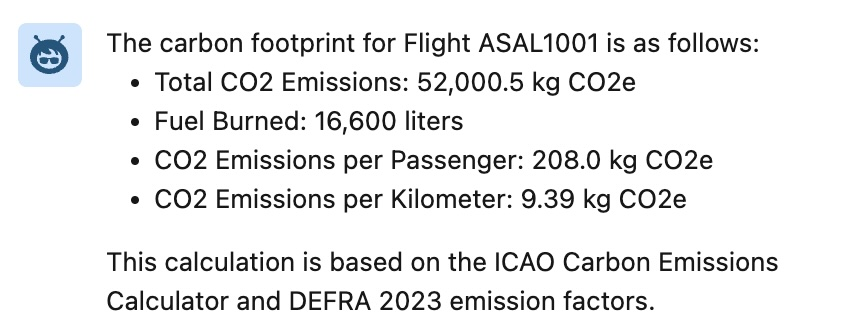
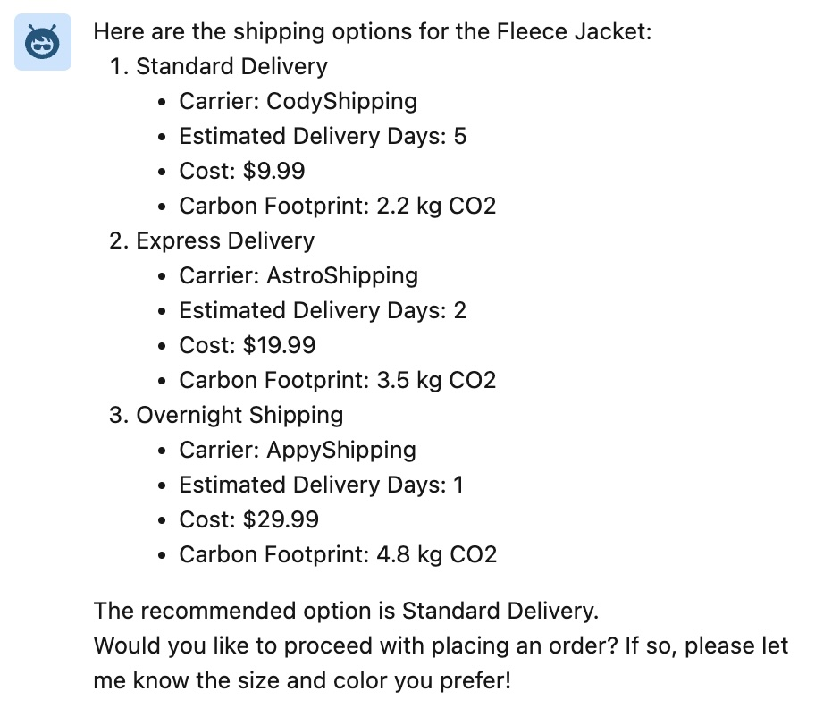

# TDX25 - Heroku at Camp Mini Hacks - Instructions

> [!IMPORTANT]
> These instructions will be integrated into an upcoming TDX 2025 minihack.

In this workshop we're enhancing several agents with custom code written in languages of your choice, with **Heroku** and [Heroku AppLink](https://devcenter.heroku.com/articles/getting-started-heroku-integration), allowing **Apex**, **Flow**, and **Agentforce** to perform complex, compute-intensive calculations on Heroku’s scalable managed infrastructure.

> [!NOTE]
> The steps below do not require you to build or deploy the associated Heroku application, this has already been done for you. However if you want to later review the source code for these actions you can do so through [this](https://github.com/heroku-examples/heroku-tdx25-minihack-code) repository.

## Requirements

- Access to a Salesforce Org with Agentforce enabled and the TDX minihack objects and apps deployed
- Access to a Heroku environment enrolled in the `tdx25-minihack` Heroku team
- Latest Salesforce CLI installed [link](https://developer.salesforce.com/docs/atlas.en-us.sfdx_setup.meta/sfdx_setup/sfdx_setup_install_cli.htm)
- Latest Heroku CLI installed [link](https://devcenter.heroku.com/articles/heroku-cli#install-the-heroku-cli)
- Latest Heroku AppLink CLI Plugin installed [link](https://devcenter.heroku.com/articles/heroku-integration-cli)

## Steps for All Agents

1. **Logging into Heroku**

    Login to Heroku and confirm you have access to the required Heroku team:
    
    ```
    heroku login
    heroku teams
    ```

    The `heroku teams` command should show `tdx25-minihack` in your list of teams

    ```
    Team             Role         
    ──────────────── ──────────── 
    tdx25-minihack   collaborator            
    ```

2. **Connecting Heroku to your Org**

    Run the command below and when prompted enter the user and password for your org and accept the required permissions prompt:
    
    ```
    heroku salesforce:connect my-org-yourname --app tdx25-minihack-actions --store-as-run-as-user 
    ```

    > Replace `yourname` in the command above, for example, for Chris Wall use `my-org-cwall`

3. **Linking the Heroku application with your Org**

    The action code uses **Heroku AppLink** to seamlessly access data within the org. Run the following command to link the Heroku app to your org:
    
    ```
    heroku salesforce:import api-docs.yaml --org-name my-org-yourname --app tdx25-minihack-actions --client-name ActionsService
    ```

    > As per the last step be sure to edit `my-org-yourname` in the command above

    Navigate to **Heroku** under the **Setup** to confirm the application has been linked.

    

    

    In the following steps you will configure an Agentforce Action for one of the above operations.

4. **Grant Permissions to the Heroku application**

    Ensure your Salefsorce user has permission to invoke the applicaiton logic.

    ```
    sf org assign permset --name ActionsService -o my-org
    ```
    > The above command assumes you have already authenticated your org with the `sf` CLI using an alias of `my-org`. If this is note the case use the `sf org login web --alias my-org` command to authenticate and then run the above command.

5. **Deploy to your Salesforce org**

    Heroku actions need a small Flow wrapper in order to be used with Agentforce, deploy these using the command below:

    ```
    sf project deploy start --metadata Flow -o my-org
    ```

    > Support for using Heroku applications directly with Agentforce is being rolled out to our service, this step will be removed once this is complete.

## Add an action to the Astro Airlines Travel Agent

This Action uses flight informaton from Salesforce and information on CO2 emissions to give the user an estimate on how much CO2 will be used on their flight. Heroku can integrate real time with environmental data APIs (ICAO Carbon Emissions Calculator, Google Flights API (carbon estimates), IATA CO Data), collate and query flight data in memory to calculate CO₂ emissions per route, per traveler, per aircraft type, and distance traveled.

1. **Creating an Agentforce Action**

    To create an Agentforce Action search for **Agent Actions** under **Setup** to navigate to the **Agent Actions** page. Click **New Agent Action** in the top right corner, select **Flow**, search for **Calculate Carbon Footprint**. Select the action and click **Next**, complete the checkboxes as shown below and click **Finish** 

    

2. **Adding an Action to an Agent**

    Locate **Agents** under the **Setup** menu, click **Koa Car Agent**, and click **Open in Builder**. Click on the **Topics** tab, and **Koa Cars Sales Agent**, in the **This Topic's Actions** tab, click **New** > **Add from Asset Library**. Search for **Calculate Carbon Footprint**, select it and click **Finish**.
    
3. **Testing your Heroku Action**

    In **Agent Builder** enter the following to invoke your action.

    `
    What is the total carbon footprint for my upcoming flight?
    `

    

## Add an action to the Trailblazer Outfitters Retail Agent

This action retrieves information about the product, including its size and weight. Using a selection of approved shipping companies, it dynamically calls their respective APIs. It then collates the shipping costs and timelines in memory and returns them to Agentforce along with a recommendation.

1. **Creating an Agentforce Action**

    To create an Agentforce Action search for **Agent Actions** under **Setup** to navigate to the **Agent Actions** page. Click **New Agent Action** in the top right corner, select **Flow**, search for **Calculate Shipping Options**. Select the action and click **Next**, complete the checkboxes as shown below and click **Finish** 

    

2. **Adding an Action to an Agent**

    Locate **Agents** under the **Setup** menu, click **Koa Car Agent**, and click **Open in Builder**. Click on the **Topics** tab, and **Koa Cars Sales Agent**, in the **This Topic's Actions** tab, click **New** > **Add from Asset Library**. Search for **Calculate Shipping Options**, select it and click **Finish**.
    
3. **Testing your Heroku Action**

    In **Agent Builder** enter the following to invoke your action.

    `
    Can you recommend shipping options to get my item within a week for under $50 dollars?
    `

    

## Add an action to the Koa Car Agent

This Action dynamically evaluates real-time car valuations from industry sources (AutoTrader, Edmunds, KBB), assesses user credit status via finance APIs, and optimizes business margins while ensuring competitiveness against other car sellers. By leveraging Heroku’s scalable processing power, Agentforce-powered agents can make real-time, financing decisions, delivering personalized finance offers within Salesforce and empowering both dealers and buyers with transparent, competitive financing options.

1. **Creating an Agentforce Action**

    To create an Agentforce Action search for **Agent Actions** under **Setup** to navigate to the **Agent Actions** page. Click **New Agent Action** in the top right corner, select **Flow**, search for **Calculate Finance Agreement**. Select the action and click **Next**, complete the checkboxes as shown below and click **Finish** 

    

2. **Adding an Action to an Agent**

    Locate **Agents** under the **Setup** menu, click **Koa Car Agent**, and click **Open in Builder**. Click on the **Topics** tab, and **Koa Cars Sales Agent**, in the **This Topic's Actions** tab, click **New** > **Add from Asset Library**. Search for **Calculate Finance Agreement**, select it and click **Finish**.
    
3. **Testing your Heroku Action**

    In **Agent Builder** enter the following to invoke your action.

    `
    I want to buy a car with a $1,000 down payment, a max 5% interest rate, and a term over 3 years. Can you provide a competitive finance estimate?
    `

    
