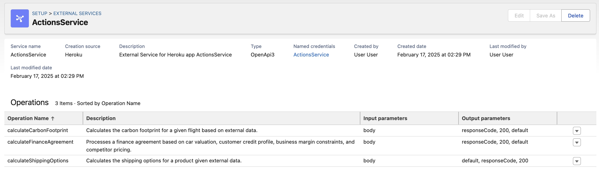

# TDX25 - Heroku at Camp Mini Hacks - Instructions

> [!IMPORTANT]
> These instructions are work in progress and intended to be integrated into an upcoming TDX 2025 minihack.

## Use Case and Why Heroku?

We are extending the eCars Car Agent with a Heroku-powered Agentforce Action via Heroku AppLink integration, enabling Apex, Flow, and Agentforce to access compute-intensive finance agreement calculations. This Action dynamically evaluates real-time car valuations from industry sources (AutoTrader, Edmunds, KBB), assesses user credit status via finance APIs, and optimizes business margins while ensuring competitiveness against other car sellers. By leveraging Heroku’s scalable processing power, Agentforce-powered agents can make real-time, financing decisions, delivering personalized finance offers within Salesforce and empowering both dealers and buyers with transparent, competitive financing options.

## Requirements

- Access to a Salesforce Org with Agentforce enabled
- Access to a Heroku environment enrolled in the `tdx25-minihack` Heroku team
- Latest Salesforce CLI installed [link](https://developer.salesforce.com/docs/atlas.en-us.sfdx_setup.meta/sfdx_setup/sfdx_setup_install_cli.htm)
- Latest Heroku CLI installed [link](https://devcenter.heroku.com/articles/heroku-cli#install-the-heroku-cli)
- Latest Heroku AppLink CLI Plugin installed [link](https://devcenter.heroku.com/articles/heroku-integration-cli)

## Steps

1. **Logging into Heroku**

    Login to Heroku and confirm you have access to the required Heroku team:
    
    ```
    heroku login
    heroku teams
    ```

    The `heroku teams` command should show `tdx25-minihack` in your list of teams

    ```
    Team             Role         
    ──────────────── ──────────── 
    tdx25-minihack   collaborator            
    ```

2. **Connecting Heroku to your Org**

    Run the command below and when prompted enter the user and password for your org and accept the required permissions prompt:
    
    ```
    heroku salesforce:connect my-org-yourname --app tdx25-minihack-calcfinance --store-as-run-as-user 
    ```

    > Replace `yourname` in the command above, for example, for Chris Wall use `my-org-cwall`

3. **Linking the Heroku application with your Org**

    We have predeployed the action code to Heroku for you, however if you want to review it you can do so [here](https://github.com/heroku-examples/heroku-tdx25-minihack-code).
    
    The action code uses Heroku AppLink to seamlessly access customer and car data within the org, as well as several external services.
    
    Run the following command to link the Heroku app with your org:
    
    ```
    heroku salesforce:import api-docs.yaml --org-name my-org-yourname --app tdx25-minihack-calcfinance --client-name CalculateFinanceAction
    ```

    > As per the last step be sure to edit `my-org-yourname` in the command above

    Navigate to **Heroku** under the **Setup** to confirm the application has been linked.

    

    

    Congrulations you have just brought the power of Heroku into your Salefsorce org and to the finger tips of your developers and admins!

4. **Grant Permissions to the Heroku application**

    Ensure your Salefsorce user has permission to invoke the applicaiton logic.

    ```
    sf org assign permset --name CalculateFinanceAction -o my-org
    ```
    > The above command assumes you have already authenticated your org with the `sf` CLI using an alias of `my-org`. If this is note the case use the `sf org login web --alias my-org` command to authenticate and then run the above command.

4. **Creating an Agentforce Action**

    Your Heroku application is now availble to Apex and Flow users to use as they would any other platform action.

    To create an Agentforce Action search for **Agent Actions** under **Setup** to navigate to the **Agent Actions** page.

    Click **New Agent Action** in the top right corner, select **API**, then **Heroku** and search for `CalculateFinanceAction`.

    Select the action and click **Next**, complete the checkboxes as shown below and click **Finish** 

    

5. **Adding the Action to the Agent**

    Navigate **Agents** under the **Setup** menu and open the *Einstein Copilot** agent in **Agent Builder**.

    Go to the **Customer Service Assistant**, click on the **Topics** tab and click **New**, selecting **From Assest Library**

    Locate the **CalculateFinanceAction** and add it to the topic.
    
6. **Testing your Heroku Action**

    In **Agent Builder** enter the following to invoke your action.

    `
    My customer XYX123 is wanting to purchase a car ABC456. The price is $25,000 and they have a downpayment of $1000. The interest rate is 5% and they want the term to be over 3 years. Can you give me the finance information for this and let me know if it is competitive with other services?
    `

    

## JSON Reqest for Heroku Action

```
{
  "customer_id": "0035g00000XyZbHAZ",
  "car_id": "a0B5g00000LkVnWEAV",
  "business_margins": {
    "dealer_markup_percentage": 5.0,
    "min_profit_margin": 2000,
    "max_discount": 1500
  },
  "competitor_pricing": [
    {
      "dealer": "AutoTrader",
      "price": 41500,
      "loan_rate": 3.5
    },
    {
      "dealer": "Carvana",
      "price": 42800,
      "loan_rate": 3.7
    }
  ]
}
```

## JSON Resposne from Heroku Action

```
{
  "customer_id": "0035g00000XyZbHAZ",
  "car_details": {
    "car_id": "a0B5g00000LkVnWEAV",
    "make": "Tesla",
    "model": "Model 3",
    "year": 2022,
    "mileage": 15000,
    "market_value": 42000,
    "trade_in_value": 35000
  },
  "recommended_finance_offer": {
    "final_car_price": 41800,
    "adjusted_interest_rate": 3.4,
    "monthly_payment": 690.50,
    "loan_term_months": 60,
    "total_financing_cost": 41430.00,
    "competitor_comparison": {
      "is_competitive": true,
      "cheapest_competitor": {
        "dealer": "AutoTrader",
        "price": 41500,
        "loan_rate": 3.5
      }
    }
  },
  "profit_analysis": {
    "profit_margin": 2150,
    "meets_min_profit_requirement": true
  },
  "counter_offer": {
    "adjusted_car_price": 41400,
    "new_interest_rate": 3.3,
    "monthly_payment": 680.75,
    "rationale": "Reduced price slightly while maintaining minimum profit margin of $2000 to stay competitive."
  },
  "decision_rationale": {
    "pricing_strategy": "Slight undercut on Carvana, matched AutoTrader with better loan rate",
    "customer_affordability_score": 85,
    "approval_status": "Approved"
  },
  "retrieved_customer_credit_profile": {
    "credit_profile_id": "a1A5g00000PjQhPEAV",
    "credit_score": 720,
    "loan_approval_status": "pre-approved",
    "down_payment": 5000,
    "loan_term_months": 60,
    "interest_rate": 3.4
  }
}
```
